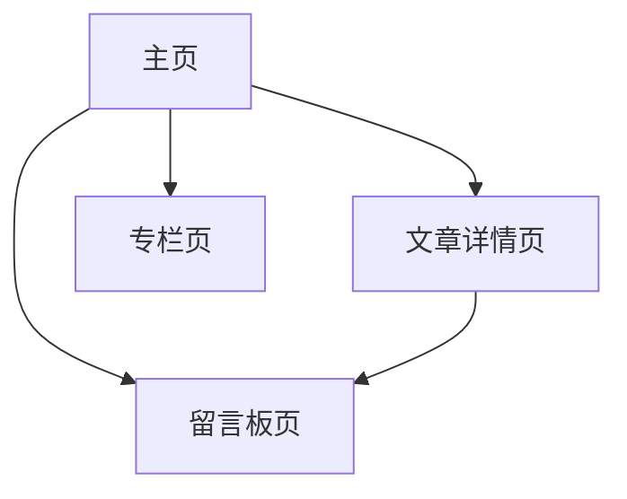

## 1. Product Overview
面向读者的博客网站主页布局设计（仅布局，不做功能实现）。
主页需包含：留言入口、动态天气组件占位、文章留言入口、专栏入口、吃货模块。

## 2. Core Features

### 2.1 Feature Module
本次需求的必要页面如下：
1. **主页**：导航、天气占位、留言入口、文章区（含文章留言入口）、专栏入口、吃货模块。
2. **文章详情页**：文章内容展示、文章留言入口。
3. **专栏页**：专栏列表（可进入专栏内容）。
4. **留言板页**：留言展示区、发布留言入口（均为占位）。

### 2.2 Page Details
| Page Name | Module Name | Feature description |
|-----------|-------------|---------------------|
| 主页 | 顶部导航 | 展示站点 Logo/名称、主导航入口（主页/专栏/留言板）。|
| 主页 | 天气组件占位 | 展示“动态天气”卡片占位（含位置/温度/天气图标的占位文案）。|
| 主页 | 留言入口 | 展示显眼 CTA 卡片/按钮，跳转至留言板页。|
| 主页 | 文章区（含留言入口） | 展示文章列表卡片（标题/摘要/时间占位）；每条文章提供“查看详情”与“留言入口”按钮/链接。|
| 主页 | 专栏入口 | 展示专栏入口区块（专栏卡片/封面占位），跳转至专栏页。|
| 主页 | 吃货模块 | 展示美食主题内容区块（图文卡片占位、标签占位）。|
| 主页 | 页脚 | 展示版权、基础链接占位。|
| 文章详情页 | 文章内容 | 展示文章标题、作者/时间、正文排版占位。|
| 文章详情页 | 文章留言入口 | 展示“去留言/讨论”入口（跳转留言板页）。|
| 专栏页 | 专栏列表 | 展示专栏卡片列表（名称/简介占位），可进入专栏内容占位页或保持为链接占位。|
| 留言板页 | 留言展示区 | 展示留言列表占位（头像/昵称/内容/时间占位）。|
| 留言板页 | 发布留言入口 | 展示输入区与提交按钮占位（不实现提交逻辑）。|

## 3. Core Process
- 浏览流程：你进入主页 → 浏览天气占位、专栏入口、吃货模块与文章列表 → 点击文章进入文章详情 → 从文章详情点击“去留言/讨论”进入留言板。
- 留言入口流程：你在主页点击“留言入口” → 进入留言板页 → 查看留言列表占位与发布留言入口占位。
- 专栏流程：你在主页点击“专栏入口” → 进入专栏页 → 浏览专栏列表占位。

