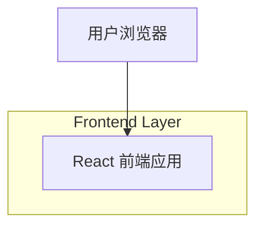

## 1.Architecture design

## 2.Technology Description
- Frontend: React@18 + vite + tailwindcss@3
- Backend: None（本需求仅做页面布局与静态占位）

## 3.Route definitions
| Route | Purpose |
|-------|---------|
| / | 主页：展示留言入口、天气占位、文章留言入口、专栏入口、吃货模块 |
| /posts/:id | 文章详情页：文章内容占位与文章留言入口 |
| /columns | 专栏页：专栏列表占位 |
| /message-board | 留言板页：留言列表与发布入口占位 |